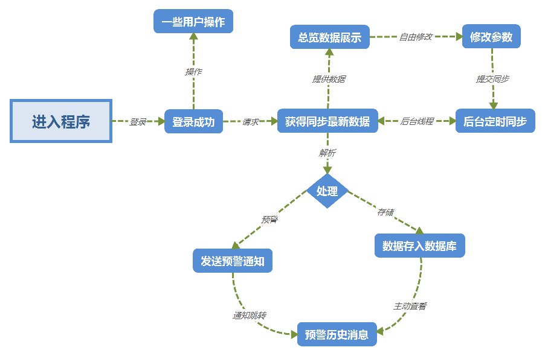
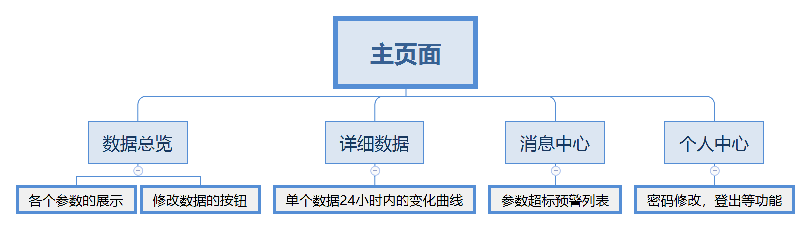

# PiscicultureManager
## 渔业养殖管理系统
### 根目录下是 Android 代码，服务端代码在 server 分支下
-----

### 水产养殖的几个参数如下：
| 参数       | 溶氧量  | PH值  | 氨氮       | 亚硝酸盐 | 余氯      | 温度   |
| ---------- | ------- | ----- | ---------- | -------- | --------- | ------ |
| 合适的区间 | 5~8mg/L | 6.5~8 | 0~0.015ppm | 0~0.5ppm | 0~0.02ppm | 20~40℃ |

#### 拟定要展示并调整的几个参数：温度、溶氧量、PH、亚硝酸盐、氨氮

-----

### 服务端一张表可以和客户端通用，表结构如下
| id（主键） | 时间戳             | 溶氧量  | 温度   | PH值  | 氨氮       | 亚硝酸盐 |
| ---------- | ------------------ | ------- | ------ | ----- | ---------- | -------- |
| 自增长     | 间隔一小时记录一次 | 5~8mg/L | 20~40℃ | 6.5~8 | 0~0.015ppm | 0~0.5ppm |

### 服务端查询回传数据如下格式
```
{
  "msg": "success",
  "code": 200,
  "time": "2019-05-19",
  "data": [
    {
      "id": 1,
      "timestamp": 1558196817,
      "oxygen": 0,
      "temperature": 0,
      "ph": 7,
      "nitrogen": 0,
      "nitrite": 0
    },
    {
      "id": 2,
      "timestamp": 1558196841,
      "oxygen": 9,
      "temperature": 40,
      "ph": 8,
      "nitrogen": 0.02,
      "nitrite": 0.6
    }
  ]
}
```

-----

### 整个系统功能架构和页面结构如下图所示：

